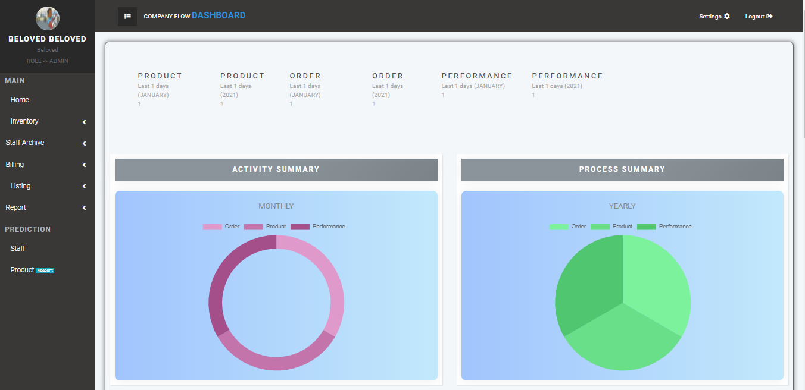

<p align="center">
    <a href="https://github.com/Belovedbb/Company-Flow/graphs/contributors"></a>
    <a href="https://github.com/Belovedbb/Company-Flow/network/members"></a>
    <a href="https://github.com/belovedbb/Company-Flow/stargazers"></a>
    <a href="https://github.com/belovedbb/Company-Flow/issues"></a>
    <a href="https://www.linkedin.com/in/ayooluwa-beloved-65710419a/"></a>
</p>


<!-- PROJECT LOGO -->
<br />
<p align="center">


</p>

<h2 align="center">Company Flow</h3>

  <p align="center">
    Company-Flow is a minimalistic web based management tool for company internal workflow
    <br />
    <a href="https://github.com/belovedbb/Company-Flow"><strong>Explore the docs »</strong></a>
    <br />
    <br />
    <a href="assets/Showcase.md">View Demo</a>
    ·
    <a href="https://github.com/belovedbb/Company-Flow/issues">Report Bug</a>
    ·
    <a href="https://github.com/belovedbb/Company-Flow/issues">Request Feature</a>
  </p>


<!-- TABLE OF CONTENTS -->
<details open="open">
  <summary>Table of Contents</summary>
  <ol>
    <li>
      <a href="#about-the-project">About The Project</a>
      <ul>
        <li><a href="#built-with">Built With</a></li>
      </ul>
    </li>
    <li>
      <a href="#getting-started">Getting Started</a>
      <ul>
        <li><a href="#prerequisites">Prerequisites</a></li>
        <li><a href="#installation">Installation</a></li>
      </ul>
    </li>
    <li><a href="#quick-overview">Quick Overview</a></li>
    <li><a href="#roadmap">Roadmap</a></li>
    <li><a href="#contributing">Contributing</a></li>
    <li><a href="#license">License</a></li>
    <li><a href="#contact">Contact</a></li>
  </ol>
</details>


<!-- ABOUT THE PROJECT -->
## ➤ About The Project



Company-Flow is a management tool that helps with managing companies activities.
It features:
* Inventory
  * Create a new product, track the record and download a concise report
  * Generate an order based on the product quantity, track and download report
* User
  * Create users, staffs and assign roles and track record of your staffs
  * Let the System generate a performance profile of each of your staff at the end of each month with reporting capabilities.
* Billing
  * Automatically create summary of estimated income and expenditure
* Dashboard Tooling
  * Show legible description of activities in terms of periods.

###  Built With
* [Java 11](https://docs.oracle.com/en/java/javase/11/docs/api/index.html)
* [SpringBoot](https://spring.io/)
* [Bootstrap](https://getbootstrap.com)
* [Bootstrapious Template](https://bootstrapious.com/)
* [Javascript](#)

<!-- GETTING STARTED -->
## ➤ Getting Started

To get a local copy up and running follow these simple example steps.

###  Prerequisites


* Java 11 or latest
* MySQL

###  Installation

The Default profile used is at application-dev.yml, feel free to change it to the provided prod config.
To run the project, you will need to create a schema, in mysql database, while changing the following below

```yml
    url: jdbc:mysql://localhost/company
    username: mysql
    password: -----
```
Run the project from ```CompanyStarter``` class on localhost:9999


<!-- quick-overview -->
## ➤ Quick Overview
This Project follows a [Hexagonal Architectural Style](https://en.wikipedia.org/wiki/Hexagonal_architecture_(software)) as opposed to  layered structure.
Company-Flow is separated into 5 modules namely,
* Store: Handle everything pertaining to persistence entities of Company-Flow.
  It Uses [Pure JPA](https://en.wikipedia.org/wiki/Jakarta_Persistence) for database operational management
* Web: Handle the view part of Company-Flow
  Thymeleaf is used as Company-Flow view resolver in conjuction with frontend technologies, the controller only does the routing from the view to the application module.
* Application: Serves as the dispatcher and house the service logic of Company-Flow. This houses the service ports, domain entities and events.
* Common: Handle common utilities used by all Company-Flow modules
* Starter: Starter mechnism for Company-Flow. The configuration of application contex of spring happens in this module.

The project uses maven as it's build system. It features Unit and Integration test between layers and modules.

<!-- ROADMAP -->
## ➤ Roadmap

See the [open issues](https://github.com/belovedbb/Company-Flow/issues) for a list of proposed features (and known issues).

<!-- CONTRIBUTING -->
## ➤ Contributing

Any contributions you make towards the project are **greatly appreciated**.

1. Fork the Project
2. Create your Feature Branch (`git checkout -b feature/AmazingFeature`)
3. Commit your Changes (`git commit -m 'Add some AmazingFeature'`)
4. Push to the Branch (`git push origin feature/AmazingFeature`)
5. Open a Pull Request


<!-- LICENSE -->
## ➤ License

Distributed under the MIT License. See `LICENSE` for more information.

<!-- CONTACT -->
## ➤ Contact

[@beloved_johnny](https://twitter.com/beloved_johnny) - belovedbb1@gmail.com

[https://github.com/belovedbb/Company-Flow](https://github.com/belovedbb/Company-Flow)
